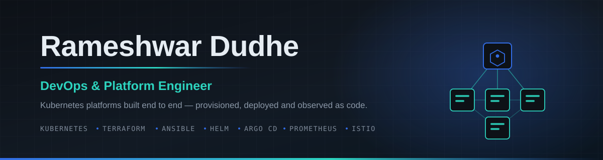

<p align="center">
  <a href="https://github.com/rameshwar-dudhe?tab=repositories"></a>
  
  
  
</p>

---

## Hi, I'm Rameshwar

DevOps Engineer with **3.7 years** building and running Kubernetes platforms — cluster
provisioning, GitOps delivery, CI/CD, and observability. Across managed control planes
(EKS, GKE), enterprise platforms (OpenShift, vSphere) and bare metal, driven end to end
by Helm, Ansible and Terraform rather than clicked together in a console.

What I care about is the part most tutorials skip: **what happens when the deploy
reports success and the cluster is still broken.** My repos ship the runbook and the
root-cause writeup alongside the code, because the second one is what you actually
need at 2am.

```yaml
role:      DevOps / Platform Engineer
focus:     Kubernetes platform engineering, IaC, GitOps, observability, AI on K8s
approach:  version-pinned · idempotent · reproducible · documented
currently: deepening SRE practice — reliability, incident response, platform UX
open_to:   DevOps · Platform Engineering · SRE
```

---

## Toolbox

**Container platform & orchestration**


**Cloud & virtualization**


**Infrastructure as code**


**CI/CD & GitOps**


**Observability & APM**


**AI engineering**


**Systems & data**


---

## Featured work

### [kube-flow](https://github.com/rameshwar-dudhe/kube-flow)
Hybrid **Helm + Kustomize** deployment of Kubeflow 26.03.1 on bare-metal Kubernetes —
KServe, Kubeflow Trainer, Spark Operator, Istio and cert-manager, version-pinned and
idempotent end to end. The kind of install that usually turns into a week of
yak-shaving, reduced to a repeatable run.

### [kubespray-2node-cluster](https://github.com/rameshwar-dudhe/kubespray-2node-cluster)
Kubernetes cluster provisioned with **Kubespray + Ansible**, Make-driven and
reproducible from a single config file. Ships with a full runbook **and a root-cause
analysis of a CoreDNS forwarding loop** that left DNS dead while Ansible cheerfully
reported `failed=0` — the diagnosis, the fix, and why it belongs in the inventory
rather than on the node.

### [terraform-iac](https://github.com/rameshwar-dudhe/terraform-iac)
Standalone **Terraform** configurations for core AWS services — VPC, EC2, ALB, RDS,
ECR, Lambda, IAM, Secrets Manager, EventBridge and Step Functions. Composable building
blocks rather than one monolithic stack.

### [kubedoom-k8s](https://github.com/rameshwar-dudhe/kubedoom-k8s)
**Helm chart** deploying KubeDoom with hardened, tightly scoped RBAC. A genuinely fun
project that doubles as a practical exercise in least-privilege service accounts.

### [mongo-replication-made-easy](https://github.com/rameshwar-dudhe/mongo-replication-made-easy-)
Step-by-step guide and command logs for a two-node **MongoDB replica set** on Ubuntu —
written so someone else can follow it without guessing.

---

## In the pipeline

Working toward public release: Argo CD self-healing GitOps, Jenkins X on
Ansible-provisioned HA Kubernetes, Velero backup and restore, a full
Prometheus/Grafana/Loki monitoring stack, OpenTelemetry instrumentation, and
Bazel-built CI pipelines.

---

## Activity

<p align="center">
  
  
</p>

---

## Reach me

<p align="center">
  <a href="mailto:rndudhe1808@gmail.com"></a>
  <a href="https://github.com/rameshwar-dudhe"></a>
</p>

<p align="center"><sub>Open to DevOps, Platform Engineering and SRE roles.</sub></p>
